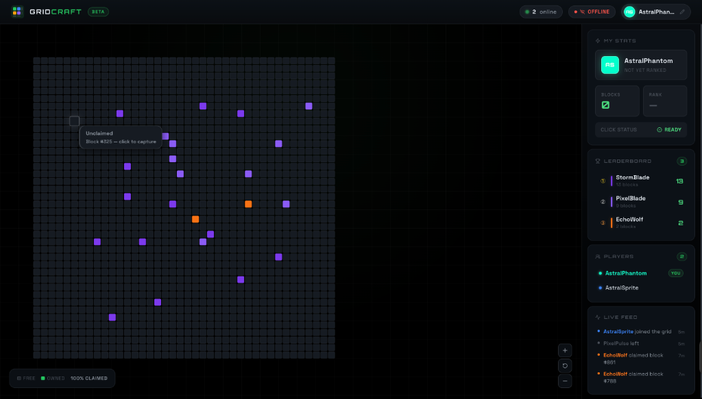
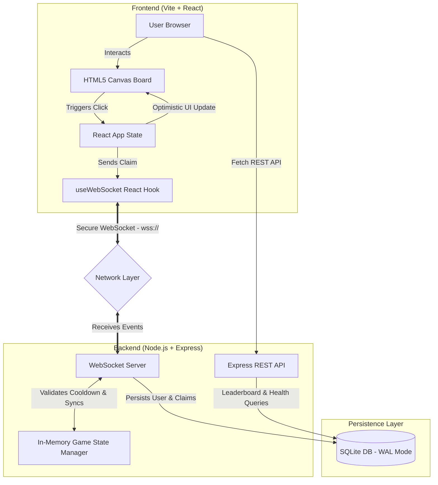

# GridCraft

GridCraft is a high-performance, real-time shared grid application built with an OLED Dark Mode theme. Multiple users can claim cells (blocks) on a 40x40 grid and view each other's claims instantly.



## System Architecture



## Key Features

- **OLED Dark Mode UI**: A visually stunning dashboard built with custom CSS variables, custom Space Grotesk/Orbitron typography, and subtle cyber glow accents.
- **Real-Time Synchronisation**: Dynamic state synchronization powered by WebSockets.
- **Zero-Latency Interactions**: Optimistic client-side UI updates that show cell ownership instantly while confirming with the server.
- **Claim Cooldown System**: A 1.5-second cooldown timer visualised via high-performance micro-animations and tickers to prevent abuse.
- **Live Leaderboard**: Interactive leaderboard showcasing top players with relative progress bars.
- **Online User List**: Sidebar feed displaying currently connected users, their designated colors, and activity logs.
- **Interactive Canvas**: High-performance canvas-based grid with panning, zooming, custom tooltips, and claim burst animations.

## Tech Stack

- **Frontend**: React (TypeScript), Vite, Canvas API, Lucide Icons
- **Backend**: Node.js, Express, WebSocket (ws), SQLite3 (WAL mode)
- **Styling**: Vanilla CSS (Custom UI/UX Theme)

---

## Getting Started

### Prerequisites

Make sure you have [Node.js](https://nodejs.org/) (v16+) and [npm](https://www.npmjs.com/) installed.

### Installation

1. **Clone the Repository**:
   ```bash
   git clone https://github.com/Gautam-Bharadwaj/GridCraft.git
   cd GridCraft
   ```

2. **Install Dependencies**:
   * For the Backend:
     ```bash
     cd backend
     npm install
     ```
   * For the Frontend:
     ```bash
     cd ../frontend
     npm install
     ```

### Running Locally

1. **Start the Backend Server**:
   ```bash
   cd backend
   npm run dev
   # Server runs on http://localhost:4000
   ```

2. **Start the Frontend Dev Server**:
   ```bash
   cd ../frontend
   npm run dev
   # Vite App runs on http://localhost:3000
   ```

---

## Deployment Guide

### Backend Deployment (e.g. Railway / Render)
1. Deploy the `backend` subdirectory.
2. Set the start command to `npm start`.
3. Set environment variables:
   - `PORT=4000`
   - `NODE_ENV=production`
4. Mount a persistent disk volume at `/app/backend/data` to persist the SQLite database.

### Frontend Deployment (e.g. Vercel / Netlify)
1. Deploy the `frontend` subdirectory.
2. Set the build command to `npm run build` and output directory to `dist`.
3. Set environment variable:
   - `VITE_WS_URL=wss://your-backend-service-url`
