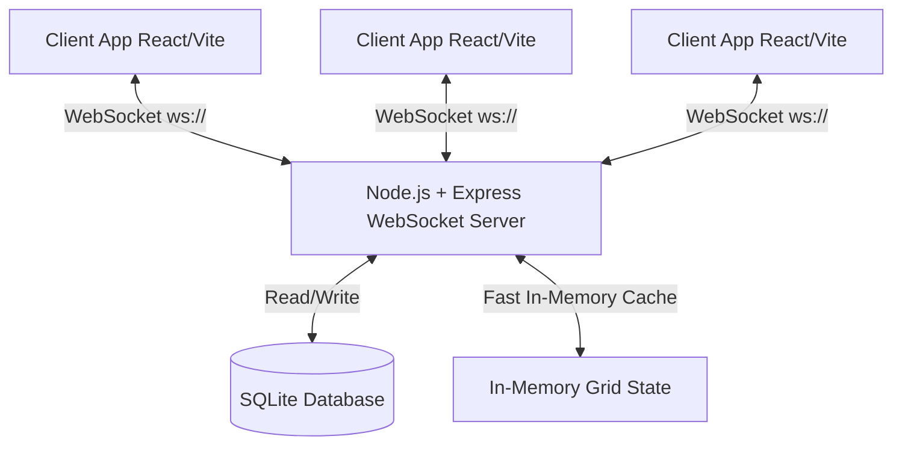

# Technical Requirements Document (TRD) & System Design

## 1. System Architecture Overview



To deliver sub-100ms real-time responsiveness, GridCraft uses an event-driven architecture combining a **Vite + React** single page application with a **Node.js/Express TypeScript** WebSocket server and an **SQLite** database for persistence.

### Why this Tech Stack?
1. **Frontend**: Vite provides blazing-fast hot module replacement. React manages state hierarchy efficiently. Vanilla CSS handles performance-tuned animations and customized themes without CSS framework bloat.
2. **Backend**: Node.js runs on a single-threaded event loop, which inherently acts as a lock-free queue for concurrent WebSocket connections. This simplifies processing race conditions on block claims.
3. **Database**: SQLite is self-contained, does not require an external background process to run locally, and handles transactional writes reliably. It is perfect for storing persistent user accounts and initial grid state.

---

## 2. Real-time Message Protocol

All real-time communication occurs over a single WebSocket connection. Messages are serialized as JSON.

### Client-to-Server Messages
- `JOIN`: Sent when a client connects.
  ```json
  { "type": "JOIN", "payload": { "username": "NeonKnight", "color": "#FF007F" } }
  ```
- `CLAIM_BLOCK`: Sent when a user clicks an unclaimed or owned block.
  ```json
  { "type": "CLAIM_BLOCK", "payload": { "blockId": 412 } }
  ```
- `PING`: Keep-alive message to prevent connection timeouts.

### Server-to-Client Messages
- `INITIAL_STATE`: Sent immediately after a client successfully joins. Includes current grid state, online user count, active users list, leaderboard, and user's session config.
  ```json
  {
    "type": "INITIAL_STATE",
    "payload": {
      "grid": { "412": { "ownerId": "usr_abc123", "ownerName": "NeonKnight", "color": "#FF007F", "claimedAt": 1781293200000 } },
      "users": { "usr_abc123": { "username": "NeonKnight", "color": "#FF007F" } },
      "onlineCount": 5,
      "leaderboard": [{ "username": "NeonKnight", "score": 25 }]
    }
  }
  ```
- `BLOCK_UPDATE`: Broadcast to all users when a block is successfully claimed.
  ```json
  {
    "type": "BLOCK_UPDATE",
    "payload": {
      "blockId": 412,
      "ownerId": "usr_abc123",
      "ownerName": "NeonKnight",
      "color": "#FF007F",
      "claimedAt": 1781293200000
    }
  }
  ```
- `COOLDOWN_ERR`: Sent back to the sender if they click a block before their cooldown expires.
  ```json
  { "type": "COOLDOWN_ERR", "payload": { "cooldownRemainingMs": 1200 } }
  ```
- `USER_LIST_UPDATE`: Broadcast when a user joins or leaves.

---

## 3. Backend Database & State Schema

### 3.1 In-Memory Fast State (Server Memory)
The server retains the active grid state in memory as an object map indexed by `blockId` (e.g. `Record<number, Block>`) for $O(1)$ lookup speed. This eliminates database query latency during high-velocity gameplay.

### 3.2 Relational Database Schema (SQLite)

#### Table: `users`
Stores user profile information.
- `id` (TEXT, PRIMARY KEY): Unique UUID or connection-based ID.
- `username` (TEXT, UNIQUE): Current screen name.
- `color` (TEXT): Selected hex color code.
- `created_at` (DATETIME): Time of creation.

#### Table: `blocks`
Stores the current state of each block.
- `id` (INTEGER, PRIMARY KEY): Block index (e.g., `0` to `2499` for a 50x50 grid).
- `owner_id` (TEXT, FOREIGN KEY references `users.id`): ID of current owner, or `NULL` if unclaimed.
- `claimed_at` (DATETIME): Timestamp of last claim.

#### Table: `claim_history`
Audit log of block claim events, allowing leaderboard compilation and replay analysis.
- `id` (INTEGER, PRIMARY KEY AUTOINCREMENT)
- `block_id` (INTEGER)
- `user_id` (TEXT)
- `claimed_at` (DATETIME)

---

## 4. Conflict Resolution & Concurrency Flow

When two users click the same block at the same time:

```mermaid
sequenceDiagram
    participant User A
    participant User B
    participant Server
    participant DB

    User A->>Server: CLAIM_BLOCK (blockId: 412) - arrives at t=10ms
    User B->>Server: CLAIM_BLOCK (blockId: 412) - arrives at t=12ms
    
    rect rgb(30, 30, 40)
        Note over Server: Server locks block 412 in-memory
        Note over Server: Check User A cooldown: OK
        Note over Server: Claim block for User A
    end
    
    Server->>DB: UPDATE blocks SET owner_id = UserA where id = 412
    Server->>User A: Broadcast BLOCK_UPDATE (412 -> User A)
    Server->>User B: Broadcast BLOCK_UPDATE (412 -> User A)

    rect rgb(30, 30, 40)
        Note over Server: Process User B message
        Note over Server: Check User B cooldown: OK
        Note over Server: Check block 412 owner: already owned by User A.
        Note over Server: (Allow B to overwrite A, but trigger Cooldown for B)
    end
    
    Server->>DB: UPDATE blocks SET owner_id = UserB where id = 412
    Server->>User A: Broadcast BLOCK_UPDATE (412 -> User B)
    Server->>User B: Broadcast BLOCK_UPDATE (412 -> User B)
```



### Key Concurrency Safeguards:
1. **Single-threaded Event Handling**: Node's event loop serializes block capture requests. A queue verifies cooldowns and ownership updates sequentially.
2. **Transaction Security**: Database updates use transactions. If an invalid claim is processed, the query rolls back, and the client state is synchronized with the truth.
3. **Client-Side Optimistic Updates**: The client updates the grid visually immediately upon clicking. However, if the server returns a cooldown error or is captured by someone else first, the client state rolls back to align with the server's update.

---

## 5. UI/UX Flow & Wireframe Mockups

### Viewport Layout
- **Header**: App Logo/Name, Connection Status (Glowing dot: Green/Red), Online User Counter, Current User Name (Editable tag), Current User Color picker.
- **Main Area**: 
  - **Left / Center**: Responsive Interactive Canvas/SVG Grid (Zoomable & Pannable). Hover highlights. Clicking triggers a wave/particle visual effect.
  - **Right Sidebar**:
    - Live leaderboard (Top 5 players by block count).
    - My stats (Current Blocks Owned, Cooldown Indicator, Rank).
    - Event Ticker (Live notifications of who claimed what).
- **Footer**: Hotkey tips (e.g., Space to reset zoom, Arrow keys to scroll).
